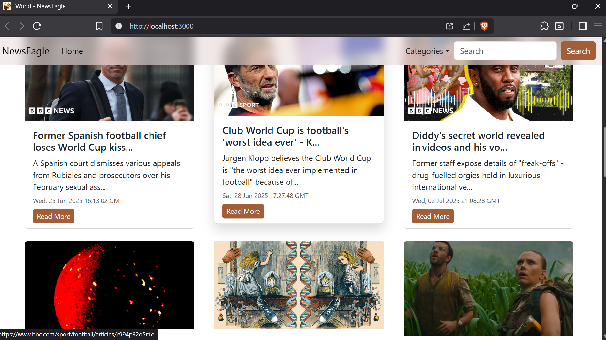

# 🦅 News Eagle

**News Eagle** is a React-based web application that delivers the latest news headlines from around the world. It uses the [NewsAPI](https://newsapi.org) to fetch real-time news articles based on user-selected categories. The app features a clean UI, category switching, search functionality, loading indicators, and is built with performance and scalability in mind.

---

## 🔧 Features

* 🌍 Browse and search global news headlines
* 📰 Category-based filtering (e.g. Business, Entertainment, Sports)
* 🔄 Real-time data fetching with progress bar
* 📱 Responsive design for desktop and mobile
* ⚡ Optimized using functional components and hooks

---

## 🛠️ Tech Stack

* **Frontend:** React.js, React Hooks, Bootstrap
* **Routing & Components:** React Router, Component-based architecture
* **Loading UI:** `react-top-loading-bar`, Bootstrap placeholders
* **API:** [NewsAPI.org](https://newsapi.org)

---

## 📸 Screenshots



---

## 🎥 Demo Video

[Watch Demo on YouTube](https://www.youtube.com/watch?v=yCM9lcJ5w6E)

---

## 🚀 Getting Started

### Prerequisites

* Node.js (v14 or above recommended)
* npm

### Installation

1. Clone the repository:

   ```bash
   git clone https://github.com/nishchyapratapsingh/news-eagle.git
   cd news-eagle
   ```

2. Install dependencies:

   ```bash
   npm install
   ```

3. Create a `local.env` file in the root and add your NewsAPI key:

   ```
   REACT_APP_API_KEY=your_api_key_here
   ```

4. Start the development server:

   ```bash
   npm start
   ```

---

## 🌐 Deployment

To build the app for production:

```bash
npm run build
```

You can deploy it using platforms like **Vercel**, **Netlify**, or **GitHub Pages**.

⚠️ *Note: NewsAPI’s free tier does not support public deployment. Use a backend proxy or upgrade your plan to host live.*

---

## 👨‍💻 Author

**[Nishchya Pratap Singh](https://github.com/nishchyapratapsingh)**

---

## 📄 License

This project is open-source under the [MIT License](LICENSE).

